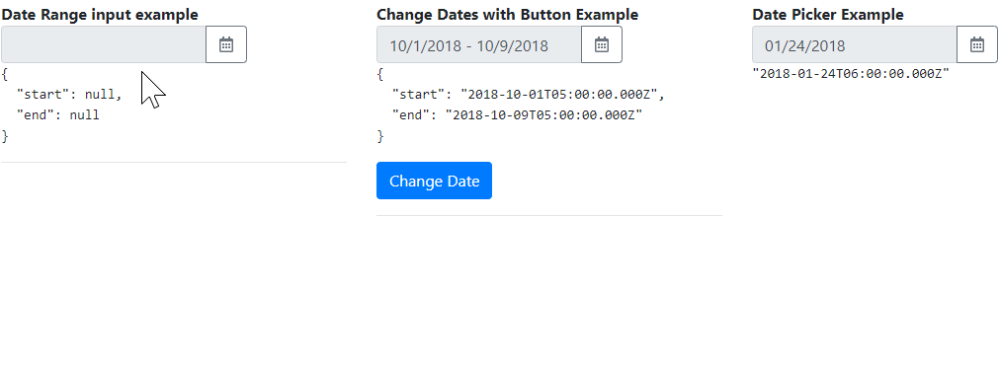

# DateRangePicker

An Angular library of Date Range Picker. Dependencies: Angular, ng-bootstrap, Bootstrap >4 (css)

Since **v19.0.0**, this library is only compatible with Angular >=19 and ng-bootstrap >=18.

Since **v7.0.0**, this library is only compatible with Angular >=13 and ng-bootstrap >=12.

Since **v6.0.0**, this library is only compatible with Angular >=13 and ng-bootstrap >=11.

Since **v5.0.0**, this library is only compatible with Angular >=12 and ng-bootstrap >=10.

Since **v4.0.0**, this library is only compatible with Angular >=10 and ng-bootstrap >=7.

Since **v3.0.0**, this library requires @angular/localize, due to updates in Angular 9 and ng-bootstrap 6.

[](https://github.com/changhuixu/date-range-picker/actions)
[](https://www.npmjs.com/package/@uiowa/date-range-picker)

```bash
npm i @uiowa/date-range-picker
```

## [Demo](https://changhuixu.github.io/date-range-picker/)



## Models

- `DateRange`: an object represents a date range, includes start date and end date. e.g.,

```typescript
const d1 = new DateRange();
const d2 = new DateRange(new Date(), new Date(2018, 9, 10));
const d3 = DateRange.nextTwoWeeks();
const d4 = DateRange.nextDays(10);
const d5 = DateRange.nextMonth();
```

## Components

- `<date-picker></date-picker>`: a wrapper of ng-bootstrap date picker

- `<date-range-picker></date-range-picker>`: a date range picker based on ng-bootstrap

## Usage

```typescript
import { DateRangePickerModule } from '@uiowa/date-range-picker';

@NgModule({
  declarations: [AppComponent],
  imports: [
    ...,
    DateRangePickerModule,
    ...
    ],
  providers: [],
  bootstrap: [AppComponent]
})
```

```html
// in your component.html
<date-range-picker
  [(dateRange)]="dateRange"
  [maxDate]="maxDate"
></date-range-picker>
<date-picker [(date)]="date"></date-picker>
```

```typescript
import { Component, OnInit } from '@angular/core';
import { DateRange } from '@uiowa/date-range-picker';

@Component({
  ...
})
export class AppComponent implements OnInit {
  dateRange = new DateRange();
  maxDate = new Date();
  date: Date;
  ngOnInit(): void {
    this.maxDate.setDate(this.maxDate.getDate() + 20);
  }
}
```
